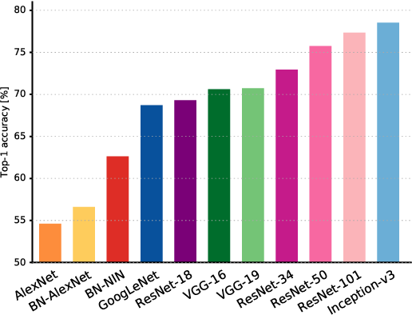

# Road Semantic Segmentation
Semantic segmentation is a natural step in the progression 
from coarse to fine inference:The origin could be located at classification, 
which consists of making a prediction for a whole input.The next step is detection, 
which provide not only the classes but also additional information regarding 
the spatial location of those classes. Finally, semantic segmentation achieves 
fine-grained inference by making dense predictions inferring labels for every pixel, 
so that each pixel is labeled with the class of its enclosing object ore region.
# Accuracy of Different Deep Networks

## AlexNet
Toronto’s pioneering deep CNN that won the 2012 ImageNet competition with a test 
accuracy of 84.6%. It consists of 5 convolutional layers, max-pooling ones, 
ReLUs as non-linearities, 3 fully-convolutional layers, and dropout.
## VGG-16
This Oxford’s model won the 2013 ImageNet competition with 92.7% accuracy. 
It uses a stack of convolution layers with small receptive fields in the 
first layers instead of few layers with big receptive fields.
## GoogLeNet
This Google’s network won the 2014 ImageNet competition with accuracy of 93.3%. 
It is composed by 22 layers and a newly introduced building block called inception module. 
The module consists of a Network-in-Network layer, a pooling operation, 
a large-sized convolution layer, and small-sized convolution layer.
## ResNet
This Microsoft’s model won the 2016 ImageNet competition with 96.4 % accuracy. 
It is well-known due to its depth (152 layers) and the introduction of residual blocks. 
The residual blocks address the problem of training a really deep architecture 
by introducing identity skip connections so that layers can copy 
their inputs to the next layer.

# Getting Started
Clone the repository and run **train.py** to train the model. 
The command line parameters that **train.py** are described in argparser help comments. The script will check for the pre-trained 
model weights and dataset, and automatically download them if they don't exist.
# Downloading from source
The KITTI road dataset should be unzipped and placed in a subdirectory called **data**, 
so the final path to the images is consistent with the one in **constants.py**.
The pre-trained ResNet weights should be placed in a subdirectory called **models**, 
so the final path is consistent with that in **constants.py**.
# Downloading dataset
Download the KITTI road dataset base kit from the 
[KITTI Vision Benchmark Suite website](http://www.cvlibs.net/datasets/kitti/eval_road.php)

